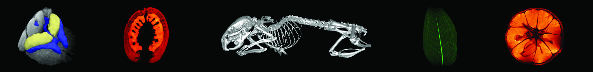







{}
The Australian Mouse Brain Mapping Consortium (AMBMC) aims to provide researchers with access to a national facility to characterise their mouse models of neurological disease
{}

{}
A collection of 7T human brain MRI models. These are built using a Minimum Deformation Averaging technique and have resolutions below 0.3mm isotropic. Multiple contrasts are included
{}

{}
Tissue Stack is an open source web based image viewer which allows the user to 
view 3D data as 2D cross sections
{}

{}
Look for radiotracers available in Australia, verify their availability, link with the experts and build up your successful research and service
{}




This website is a repository for larger projects that release data, the official website of the NIF is <a href="https://www.anif.org.au">www.anif.org.au</a>. Service uptimes found <a href="https://stats.uptimerobot.com/vr719fE3jY">here</a>


<!--

The NIF site for imaging data

The Australian National Imaging Facility (NIF) is a $130 million project that provides state-of-the-art imaging capability of animals, plants, and materials for the Australian research community. NIF’s grid of imaging facilities spreads across Australia, aiming to provide a range of leading-edge imaging instrumentation and expertise in the optimal use of imaging technology to the Australian research community.

Established in 2007, NIF is one of the four initiative projects implemented by the Australian Government, under the National Collaborative Research Infrastructure Strategy (NCRIS) Characterisation capabilities. Recently, NIF has further expanded by the Education Investment Fund (EIF), which supports world-leading, strategically-focused infrastructure investments that will transform Australian tertiary research and education.

The goal of the NIF is to provide state-of-the-art imaging of animals, plants and materials for the Australian research community. The NIF operates as an integrated grid of thirteen institutions, providing a range of leading-edge imaging instrumentation and advice and assistance in the optimal use of imaging to the research community.

Specifically, the NIF provides:

access to molecular imaging instrumentation, including a range of MRI and PET scanners;
development and validation of novel biomarkers/radioligands for in-vivo imaging using PET and MRI;
development and application of stable isotope-labelled analogues to new radio-ligands;
magnetic resonance spectroscopy, coil design and pulse sequence development;
application of these new technologies in large-scale trials in animal models of disease;
bio-mathematical modelling of tracer kinetic data and integration of the high-dimensional data in a dedicated neuroinformatics system;
the creation of databases of normative data, and a common platform of base data; and
links to existing national infrastructure for ultra-structural imaging and measurement technologies through the Australian Microscopy and Microanalysis Research Facility.
This website is a repository for larger projects that release data, the official website of the NIF is www.anif.org.au

Projects
AMBMC - The Australian Mouse Brain Mapping Consortium (AMBMC) aims to provide researchers with access to a national facility to characterise their mouse models of neurological disease. The AMBMC will use state-of-the-art imaging, computational anatomy and image analysis to enable multi-dimensional statistical comparisons of brain anatomy between the mouse model and background strain.
Human 7T - A collection of 7T human brain MRI models. These are built using a Minimum Deformation Averaging technique and have resolutions below 0.3mm isotropic. Multiple contrasts are included.

-->
