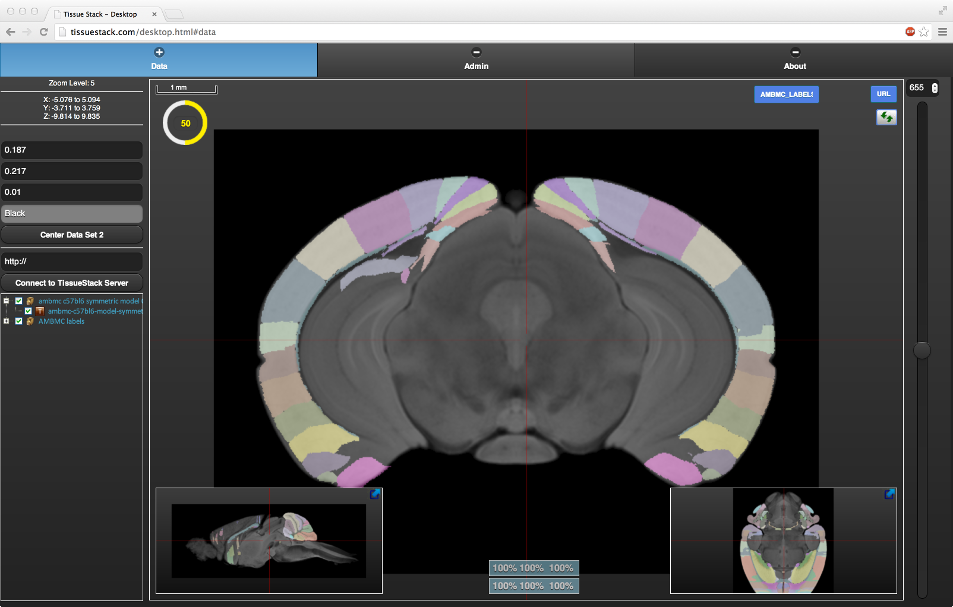
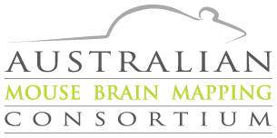
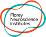

## Our Objectives
The Australian Mouse Brain Mapping Consortium (AMBMC) aims to provide researchers with access to a national facility to characterise their mouse models of neurological disease. The AMBMC will use state-of-the-art imaging, computational anatomy and image analysis to enable multi-dimensional statistical comparisons of brain anatomy between the mouse model and background strain. The AMBMC was funded by an National Health and Medical Research Council Enabling Grant (436673).

## Method
Eighteen animals were perfused and fixed with 4% paraformaldehyde and 0.1% Magnevist®. Brains were extracted and incubated in 0.1% Magnevist/PB for 4 days, placed in Fomblin and imaged on a 16.4T (89mm) Bruker micro-imaging system using a 15 mm SAW coil (M2M Imaging, USA). MRI data were acquired using a 3D gradient echo sequence with TR/TE/FA= 50ms/12ms/30°, 82 KHz spectral bandwidth, and 8 excitations with an acquisition time of 5h 15mins to produce T1/T2*-weighted images at 30µm3 isotropic resolution. A complete protocol can be downloaded [here <i class="fas fa-external-link-alt"></i>](/uploads/AMBMC/AMBMC_mouse_brain_protocol.pdf).

## Data

| Link                            | Strain   | Description                              |
|---------------------------------|----------|------------------------------------------|
| [Model](Model)               | c57bl/6j | Average mouse structural model           |
| [Hippocampus](Hippocampus)   | c57bl/6j | Average mouse model Hippocampus labels   |
| [Cerebellum](Cerebellum)     | c57bl/6j | Average mouse model Cerebelum labels     |
| [Cortex](Cortex)             | c57bl/6j | Average mouse model Cortex labels        |
| [BasalGanglia](BasalGanglia) | c57bl/6j | Average mouse model Basal Ganglia labels |
| [Diencephalon](Diencephalon) | c57bl/6j | Average mouse model Diencephalon labels  |

## FSL atlas package
An atlas packages including a default fitting procedure for FNIRT is now available here:

[FSL Package <i class="fas fa-download"></i>](/uploads/AMBMC/ambmc-c57bl6-FSL-atlas_v0.8.tar.gz)

## Online Atlas
An online version of all the AMBMC labels for both web browsers and tablets is available via [tissuestack <i class="fas fa-external-link-alt"></i>](https://tissuestack.org)

## Access Policy
<!-- For details regarding access to AMBMC please [click here](AccessPolicy) -->

Access to imaging facilities via the AMBMC is inclusive of access to equipment and expertise; the latter will include project design, image acquisition and data analysis and interpretation.

### Criteria
Access is merit-based to ensure optimal utilisation of resources. Criteria for determining merit include:
- Scientific excellence of the research proposal-
- Appropriateness of methods provided by AMBMC to research questions posed by the investigator
- Ability of the AMBMC to meet the requirements of the investigator
- Capacity of the investigator to meet the costs of the study
- Capability and track record of the research team, including ability of the investigator to provide model animals in a timely manner in a laboratory which complies with the NHMRC code of practice
- The alignment of the project with the national research priorities
- The industrial and social impact of the project for the wider Australian community

Priority will be given to projects funded under peer-reviewed competitive granting schemes.

### Arrangements
Access arrangements will be guided by the following principles: 
- All users will be treated the same regardless of their host organisation.
- Prioritisation of access by users will follow standard consideration regarding merit of research, urgency or deadline issues etc.
- Intellectual property (IP) will belong to users except where other arrangements have been made.

<!-- ## Application form
Please fill out this application_form.docx Δ in order to use the facilities of the AMBMC -->

## Contact Us
If you have any specific enquiries, please email the authors on their respective pages.

## About

The Australian Mouse Brain Mapping Consortium is funded through the Enabling Grant Scheme of the National Health and Medical Research Council of Australia (NHMRC). The Consortium is a national network comprising four nodes based in Melbourne, Brisbane and Sydney. These nodes include the involvement of Monash University, the Howard Florey Institute, the University of Queensland (Queensland Brain Institute and the Centre for Advanced Imaging), and the Prince of Wales Medical Research Institute.

The Chief Investigators at each of the nodes are:
- Professor David Reutens, The Centre for Advanced Imaging
- Professor Perry Bartlett, Queensland Brain Institute
- Professor Graham Galloway, Centre for Advanced Imaging
- Professor George Paxinos, Prince of Wales Medical Research Institute
- Dr Steven Petrou, Howard Florey Institute
- Professor Gary Egan, Howard Florey Institute
- Professor Charles Watson, Prince of Wales Medical Research Institute

